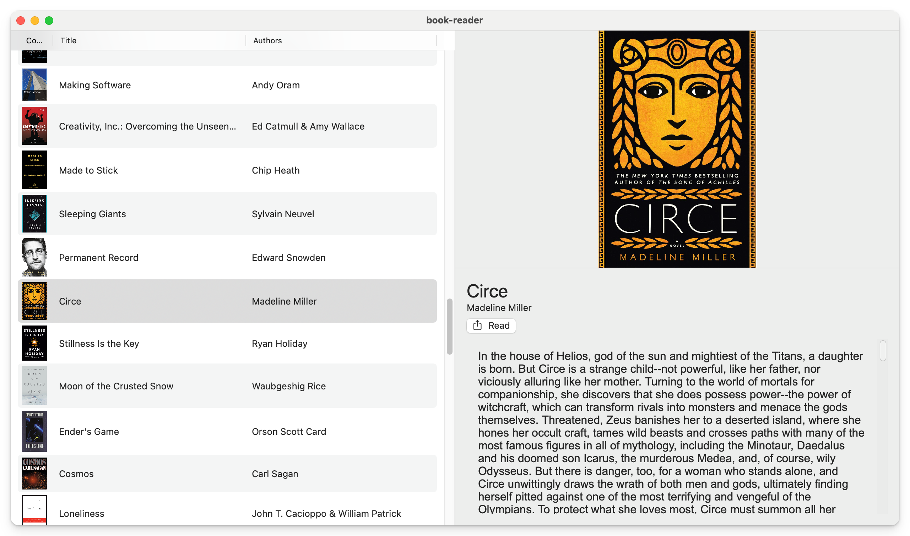

# native-macos-digital-library

An (unnamed) native macOS app that allows you to view your Calibre library without opening calibre.

  <picture>
    <source media="(prefers-color-scheme: dark)"
    srcset="./assets/images/hero-main-dark.png" />
    
  </picture>

## Why?

Calibre sucks.
It's bloated, insecure, poorly written, not visually designed at all.

All I want is a set of tools that allow me to manage my library without frustrating me.
Calibre is not that tool.
